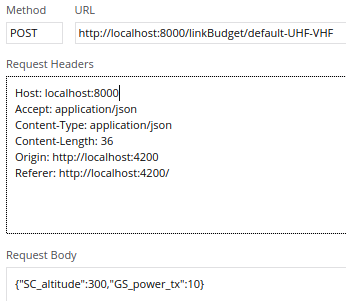

# Current API

Pros :
- Can extend with as many parameters as needed

Cons :

# API design
Some considerations of what could be added to the previous API, if needed

Keeping POST : this is equivalent to 'ordering' a calculation

Endpoints :
- POST /uplink
- POST /downlink
- POST /linkbudget
- request associated to tools?

Functionalities :
- Handle different units passed along the values in the request

# TODO
+ A clear documentation of how to use the API is a must ! Will save me and potentially others ton of time
+ Map the linkpredict calculation functions to possible endpoints (while keeping abstraction)

# Others

Avoid redundant / useless calculation as much as possible (by adding a fixme for instance)