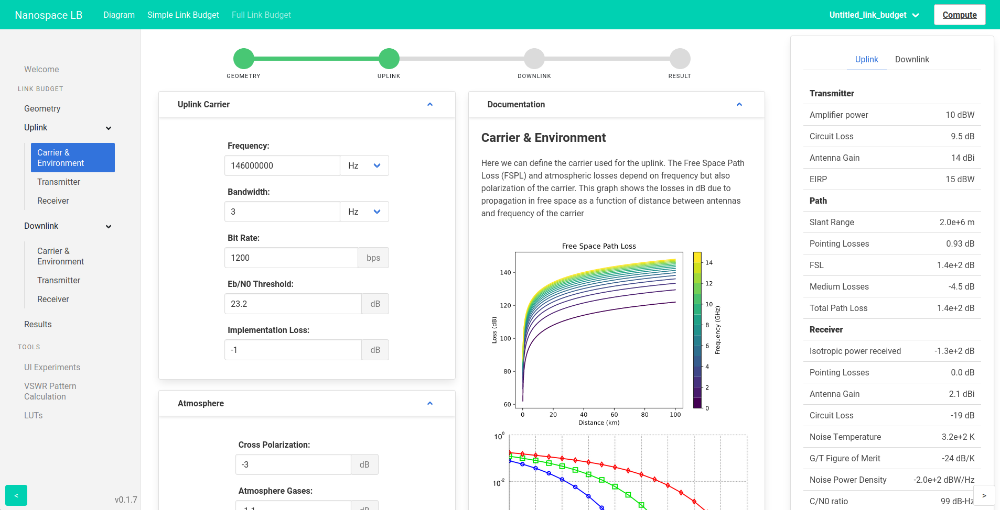
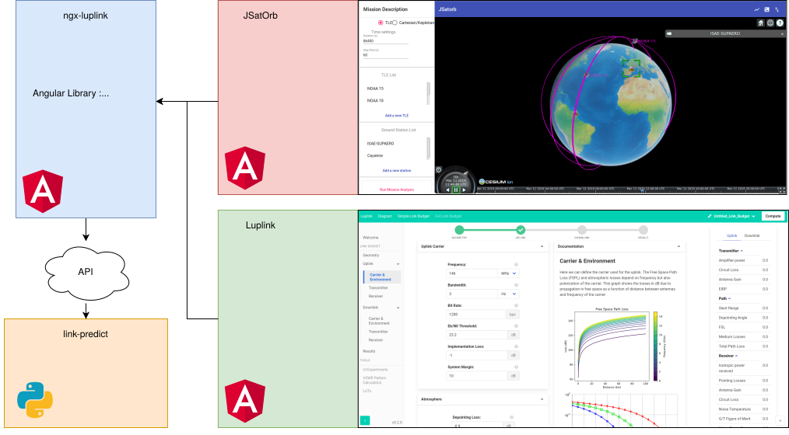

# **Luplink: an angular link budget calculation front-end**

[](https://angular.io/)<!-- ?style=flat-square) -->
[](https://www.gnu.org/licenses/agpl-3.0)

*This is the **main readme** for the Luplink project* 

*author:* Julien Prissimitzis

## **Introduction**

Luplink is an open-source front-end application for link budget calculations based on the Angular framework. The user can input multiples parameters and luplink handles calculations with its API to compute the resulting link budget.

**Standalone luplink = luplink-app + API**

It relies on the [python-linkpredict](https://gitlab.com/librecube/lib/python-linkpredict) library as a backend to handle calculations.

This project both exists as a **standalone application** and as a **library integrated inside [JSatorb](https://gitlab.isae-supaero.fr/jsatorb-dev/jsatorb/-/blob/master/README.md)**

**Noteworthy READMEs**:


- Luplink project:
  - This file is the main readme for the luplink project
  - [Luplink API's readme](./API/README.md)
- JSatorb:
  - [JSatorb's readme](https://gitlab.isae-supaero.fr/jsatorb-dev/jsatorb/-/blob/luplin_integration/README.md) contains instructions relevant to JSatorb installation and development
  - [JSatorb-frontend's readme](https://gitlab.isae-supaero.fr/jsatorb-dev/jsatorb-frontend/-/blob/luplink_integration/README.md) more specific readme about the angular fronted
- Developpers:
  - [build-tools readme](build-tools/README.md) explains how to build luplink without hassle using docker images (there is a similar section in this readme).
  - [luplink-app's readme](luplink/README.md) Some angular-specific informations (useful for developpers)
  - [ngx-luplink's readme](luplink/projects/ngx-luplink/README.md) is relevant to the ngx-luplink library and provided on the npmjs.com page for ngx-luplink package
  

<!--  -->



# **Table Of Contents**
- [**Luplink: an angular link budget calculation front-end**](#luplink-an-angular-link-budget-calculation-front-end)
  - [**Introduction**](#introduction)
- [**Table Of Contents**](#table-of-contents)
- [Getting started](#getting-started)
- [Installation](#installation)
  - [**Installing the API**](#installing-the-api)
  - [Contributing](#contributing)
  - [Troubleshooting](#troubleshooting)
    - [**ENOENT: no such file or directory**](#enoent-no-such-file-or-directory)
    - [**ENOSPC: System limit for number of file watchers reached**](#enospc-system-limit-for-number-of-file-watchers-reached)
- [Integrating ngx-luplink within JSatorb](#integrating-ngx-luplink-within-jsatorb)
- [Deployment](#deployment)
  - [With_Apache](#with_apache)
    - [Troubleshooting:](#troubleshooting-1)
- [With Apache on Fedora for ISAE-SUPAERO SI](#with-apache-on-fedora-for-isae-supaero-si)
  - [Create and run a service to manage the back-end](#create-and-run-a-service-to-manage-the-back-end)
  - [Trouble shooting](#trouble-shooting)
    - [localhost](#localhost)
    - [reload Front-End](#reload-front-end)
    - [restart Apache](#restart-apache)
    - [restart Apache](#restart-apache-1)
  - [On a debian server behind a firewall](#on-a-debian-server-behind-a-firewall)
    - [dependencies](#dependencies)
    - [backend as a service](#backend-as-a-service)
    - [apiEndPoint and firewall](#apiendpoint-and-firewall)
  - [With LiteServer](#with-liteserver)
- [Docker](#docker)
  - [Building docker images](#building-docker-images)

# Getting started

## docker-compose 

You can directly download and launch the angular frontend and its python backend using Docker in the same directory as this readme:

```bash
docker-compose up
```

and open `http://localhost:81` in your browser.

## ... or simple docker

This is equivalent to
```bash
docker run -p 80:80 -it --rm gitlab-registry.isae-supaero.fr/jsatorb-dev/luplink/luplink-front:dev

docker run -p 8001:8001 -it --rm gitlab-registry.isae-supaero.fr/jsatorb-dev/luplink/luplink-api:dev
```


# Installation

>**Note: Please see the [Docker](#docker) section if you want to build the angular application without bothering to install the Node.js/Angular stack on your local machine.**

First, we need to clone this repository:

```bash
git clone https://gitlab.isae-supaero.fr/jsatorb-dev/luplink.git
```
## **Installing the API**

In order to install the API in a virtual python environment, you can run:
```bash
cd API
python3 -m venv .luplink_env && 
source .luplink_env/bin/activate && 
pip install -r requirements.txt 
```

<!-- ```bash
pip install -r requirements.txt
``` -->
This will install the required dependencies to run the backend.

## **Testing the API**

```bash
python3 test_api.py
```
## **Installing the luplink-app frontend**

This project was created for the **version 11.2.2 of Angular**. To install an angular development environment, you first need to install **Node.js (version 14.15.5 was used)**.

### **Node installation**

The Node Version Manager can help with the installation of Node, see: https://github.com/nvm-sh/nvm#installing-and-updating

We then have access to the `nvm` command and can install Node along with its package manager (npm)
```bash
nvm install 14
```

### **Angular installation**

To install Angular CLI:
```bash
npm view @angular/cli #displays the different versions available, we're working with version 11
npm install -g @angular/cli@11.2.5
```
We still need some other packages:

```bash
npm install #Installs all the required packages
```

## **Testing**

To test the luplink and ngx-luplink (inside `luplink/` folder), there are multiples custom shorthands:

```bash
cd luplink
```

- Run integration tests and unit tests on both luplink standalone and ngx-luplink
  ```bash
  npm run test #This starts the API and run all the tests headless
  ```
- Run only unit tests in headless mode for ngx-luplink
  ```bash
  npm run tu #Only run unit-tests
  ```
- Run only integration tests for ngx-luplink
  ```bash
  npm run ti
  ```
You can add your own npm scripts inside `luplink/package.json`.
Or you can also use the default angular test command
```bash
ng test
```

and choose optional options to add to the default angular test command:
  - `--watch=false` to only run once (`true` by default, tests are re-run on each change)
  - `--browsers=ChromeHeadless` to run in headless mode (by default opens Google Chrome)

> The use of *karma-verbose-reporter* in headless mode helps. You can install it with ```npm install --save-dev karma-verbose-reporter```  (see https://github.com/usrz/javascript-karma-verbose-reporter)

For e2e testing the integration with JSatorb, see [JSatorb-frontend's readme](https://gitlab.isae-supaero.fr/jsatorb-dev/jsatorb-frontend/-/blob/luplink_integration/README.md)

# Usage

Launching the frontend (angular 11): 
```bash
cd luplink
ng serve
```
Launching the Python 3 REST API:
```bash
cd API
python3 LinkBudgetREST.py
```

# For Developers:

## Project Structure
The project is made of two main parts, the angular frontend available in the `luplink/` folder and the python backend available in `API/`.

Here is the folder structure:
- ~~`link-budget-nss-vo/`: the main part of this project, angular frontend~~ (deprecated and replaced by `luplink/`)
- `luplink/`: Angular frontend, this consists of a library `ngx-luplink` and its application for standalone use 
- `API/`: the Python backend, making the link with the link-predict library
- `diagram/`: Some standalone experiments with D3.js, not interesting in itself since it has been added to the main app.
- `graphics/`: Some of the Inkscape illustration used throughout the project. But most of them are available in the `src/assets/` directory of the main project
- `doc/`: Some ressources on link budget & link budget calculations along with the AMSAT spreadsheet, some screenshots from SatOrb. Also contains the script used to generate FSL graph.

## Making changes to the application
This process requires some explanation as the application was converted to a library in order to facilitate integration. For most angular application, you simply run `ng serve` and each code change causes a rebuild.

When working with a library, the built library is installed inside `node_modules` and only changes to the applications are taken into account. We need to add a dynamic link

You can do so by running 
```bash
bash link.sh
```

**If this previous step fails, you can do it manually:**

Here are the steps that allow to make quick changes to our library without the need to build, deploy & install it each time.

  1. Link the `ngx-luplink` library to the `luplink-app` : 
       1. Inside the `projects/ngx-luplink` folder, run `npm link`. This creates the first hook of our dynamic link
       2. Inside the `projects/luplink-app` folder, run `npm link ngx-luplink`. This creates the symlink between your node installation and the library source folder.
  2. Build the library in watch-mode: `ng build --watch=true`. The library will be rebuilt on each change.
  3. Serve the application: `ng serve --project=luplink-app`. Thanks to our dynamic link, each time the library is rebuilt, the application will also be allowing us to make changes to our library 

**Notes:** 
- the link is not commited with git so you might need to re-link the library to the app sometimes**
- If you start building the library after serving the app, this last one might crash. Simply serve the application again

See : https://medium.com/dailyjs/how-to-use-npm-link-7375b6219557 

## Testing

You can see the [**Testing**](#testing) section of this document

There are multiple npm scripts for different testing situations (provided inside `package.json`)

<!-- `npm run test` : run all tests inside Chrome whenever the project has been changed 
> If you run `ng test` instead but then the integration tests with the API might fail if you have not started it before.

`npm run th` : same as above but using Chrome Headless

`npm run tu` : Shorthand for `ng test -c unit --browsers=ChromeHeadless`. Only run unit tests

`npm run ti` : Shorthand for `ng test -c integration --browsers=ChromeHeadless`. Only run integration tests -->

## Contributing

After adding a feature, or fixing a bug, you can easily change the application version by using `npm version patch|minor|major`.

## Troubleshooting

### **ENOENT: no such file or directory**
You might encounter this error while trying to serve the `luplink-app` project :

`An unhandled exception occurred: ENOENT: no such file or directory, lstat '/home/.../luplink/luplink/node_modules/@luplink/ngx-luplink'
See "/tmp/.../angular-errors.log" for further details.`


This means that the `npm link` has not been properly done. Please see the [Making changes to the application](#making-changes-to-the-application) section

### **ENOSPC: System limit for number of file watchers reached**

While testing you might encounter the following warning:

 `Error from chokidar (/...): Error: ENOSPC: System limit for number of file watchers reached, watch '/.../tsconfig.spec.json'`

This is a kernel limitation due to the maximum inotify watchers limit being reached because of the many node files. It is safe to increase the limit, this will cause a slightly higher memory use (approx. 512MB at most for 524288 on a 64-bit system).

See [Relevant StackOverflow Question](https://unix.stackexchange.com/questions/13751/kernel-inotify-watch-limit-reached)

**Solution**:

- Check the current value : `cat /proc/sys/fs/inotify/max_user_watches`

- Temporarly increase the limit: `sudo sysctl fs.inotify.max_user_watches=524288`

- Permanently increase the limit: 
`echo fs.inotify.max_user_watches=524288 | sudo tee -a /etc/sysctl.conf && sudo sysctl -p`
# Integrating ngx-luplink within JSatorb

The basic process for integration of the ngx-luplink library inside JSatorb is to build ngx-luplink, pack it (as a .tgz file) and install the resulting npm package inside jsatorb-frontend.

This process is automated with the `build-install-luplink.sh` bash script found directly inside the `jsatorb-frontend` directory.

> Note: After running this script you might not be able to build luplink-app anymore. To solve the issue simply run the `link.sh` script (see the [Making changes to the application](#making-changes-to-the-application) section of this file)

If you do not want to install an angular environment, you can also do this integration by using docker file to build ngx-luplink (see the [Docker > For Building](#for-building) section) and others to build jsatorb-frontend (found in `jsatorb/scripts/`)

# Deployment

First we test and build the application:
```bash
ng test --watch=false --browsers=ChromeHeadless #Run tests
ng build --configuration production --ouput-path=dist/ #Build the application inside the dist/ folder
sudo mv dist/* /var/www/html/ #Move files to the default nginx/apache directory
```

## confort commands

```bash
yum install tree
yum install nano


##################
#or on local machine if internet access is not granted
git clone https://gitlab.isae-supaero.fr/jsatorb-dev/luplink


scp -r luplink root@myServer:./
git clone https://github.com/nvm-sh/nvm.git/
scp -r nvm root@myServer:./
####################

cd /root/luplink/API
python3 test_API.py


wget https://raw.githubusercontent.com/nvm-sh/nvm/v0.38.0/install.sh
bash install.sh
source ~/.bashrc
#check if ok
command -v nvm

echo "proxy = http://myproxy:3128" >> ~/.curlrc
#check if ok
cat ~/.curlrc

cd /root/luplink/link-budget-nss-v0
npm config set proxy http://myproxy:3128
npm config set https-proxy http://myproxy:3128
npm view @angular/cli
npm install -g @angular/cli@11.2.5
npm install
npm audit fix


#----------------------
cd /root/luplink/link-budget-nss-v0
ng build --configuration production 
sudo cp -r dist/* /var/www/html/
#OR from local build 
cd && mkdir git && cd git
git clone https://gitlab.isae-supaero.fr/jsatorb-dev/stage/dependencies.git
sudo cp -r dist/* /var/www/html/
#OR from docker build
cd ~/git/dcas-soft-espace/luplink/build-tools
bash build-image.sh
bash 
#----------------------

```

##Troubleshooting

```
nvm install 11  
nvm install 12
nvm alias default 12  
nvm use 11  
npm install @angular/cli -g
```

# With Apache on Fedora 

## application  deployment

```bash
sudo yum update

#required
export http_proxy=http://proxy:3128
export https_proxy=https://myproxy:3128
sudo yum install git-all
yum install python3
yum -y install python3-pip
sudo yum install wget
git config --global http.proxy http://myproxy:3128

#compile dependencies on local machine and send it on the server
scp -r me@myHost:luplink_path  root@myServer:./

#Backend preparation
cd ~/dependencies/API
pip install linkpredict
pip install -r requirements.txt

#Front-end preparation
##Appache install
sudo yum update httpd
sudo firewall-cmd --permanent --add-service=http
sudo firewall-cmd --permanent --add-service=https
sudo systemctl start httpd
sudo systemctl status httpd
hostname -I
#10.150.8.30

##Copy front-end files
cd ~/dependencies/
sudo cp -r dist/* /var/www/html/

#RUN test
#backend run (possible to run it in a service, see below...)
python3 LinkBudgetAnalysisREST.py
Ctl-C

```

## Configure_Apache
After installing apache (`sudo apt install apache2` or similar), the configuration needs to be edited in order for routing to work.

In `/etc/apache2/apache2.conf`, add the following after the last `</Directory>` tag:
```bash
<Directory "/var/www/html/">
    Options FollowSymLinks
    Allow from all
    AllowOverride All
</Directory>
```

and in `/var/www/html/.htaccess`, write: 
```bash
RewriteEngine On
      # If an existing asset or directory is requested go to it as it is
      RewriteCond %{DOCUMENT_ROOT}%{REQUEST_URI} -f [OR]
      RewriteCond %{DOCUMENT_ROOT}%{REQUEST_URI} -d
      RewriteRule ^ - [L]
      # If the requested resource doesn't exist, use index.html
RewriteRule ^ /index.html
```

https://stackoverflow.com/a/57483032/3791333

 ### Troubleshooting:

 **Apache server fails to start**:
 ```bash
 systemctl status apache2 #Gives some information about what failed
 ```
 Make sure that everything that uses the port 80 is closed (nginx, docker):
```bash
sudo service apache2 stop
```

**Error 500**:

Go check Apache error log at `cat /var/log/apache2/error.log`
If the issue is `Invalid command 'RewriteEngine'`, you can fix this by loading the `rewrite` module :

```bash
a2enmod rewrite
service apache2 restart
```


## Create and run a service to manage the back-end
on redhat distrib
```bash
# /etc/systemd/system/LinkBudgetAnalysisREST-dcas.service
[Unit]
Description=Manage LinkBudgetAnalysisREST service

[Service]
WorkingDirectory=/root/git/luplink/API/
ExecStart=/usr/bin/python3 LinkBudgetAnalysisREST.py
User=root
Type=simple
Restart=on-failure
RestartSec=15

[Install]
WantedBy=multi-user.target
```

relaunch the service daemon
```
  systemctl daemon-reload
```
you can now manage the service by using the following command

```bash
systemctl start LinkBudgetAnalysisREST-dcas.service
systemctl stop LinkBudgetAnalysisREST-dcas.service
systemctl status LinkBudgetAnalysisREST-dcas.service
journalctl -f --unit=LinkBudgetAnalysisREST-dcas.service
```

[Follow Appache installation above](#With_Apache)

## Trouble shooting

### localhost
/!\ 'localhost' is not the distant server !
### reload Front-End

```
cd /root/git/dependencies
git pull --rebase origin master
sudo cp -r dist/* /var/www/html/

```

### restart Apache

```
#Restart 
sudo systemctl restart httpd
sudo systemctl status httpd
sudo journalctl -f --unit=httpd.service

```

### Backend
```
cd /root/git/luplink/API
python3 LinkBudgetAnalysisREST.py
```

## On a debian server behind a firewall

### dependencies

```
ssh name@hostname
mkdir git && cd git
git clone https://gitlab.isae-supaero.fr/jsatorb-dev/stage/dependencies.git
sudo apt-get install python3-venv

cd API
python3 -m venv .luplink_env
source .luplink_env/bin/activate
pip install -r requirements.txt 

sudo apt install apache2
sudo ufw allow "WWW Full"
```
routing Appache ??

### backend as a service

```
# /etc/systemd/system/LinkBudgetAnalysisREST-dcas.service
[Unit]
Description=Manage LinkBudgetAnalysisREST service

[Service]
WorkingDirectory=/home/harak/git/luplink/API/
ExecStart=/home/harak/git/luplink/luplink_env/bin/python LinkBudgetAnalysisREST.py
User=root
Type=simple
Restart=on-failure
RestartSec=15

[Install]
WantedBy=multi-user.target
```

```
sudo systemctl daemon-reload
sudo systemctl start LinkBudgetAnalysisREST-dcas.service
sudo systemctl stop LinkBudgetAnalysisREST-dcas.service
sudo systemctl status LinkBudgetAnalysisREST-dcas.service
sudo systemctl restart LinkBudgetAnalysisREST-dcas.service
sudo journalctl -f --unit=LinkBudgetAnalysisREST-dcas.service
```

### apiEndPoint and firewall
```
~/git/dependencies/dist$ 
vim main.js

this.apiEndPoint = 'http://10.150.8.30:8001/';

cd ~/git/dependencies
sudo cp -r dist/* /var/www/html/

sudo ufw allow 8001/tcp
```

## With LiteServer
An alternative to using Apache is to use liteserver (reference: https://angular.io/guide/deployment)

```bash
lite-server --baseDir="dist/link-budget-v0"
```
Lite server can be installed with :
```bash
npm install --global lite-server
```


# user on ssh dcas@dcas-luplink

```
ssh dcas@dcas-luplink

```


**This last method is for development and testing only**, and is not a supported or secure way of deploying an application.

# Docker

> You can launch standalone luplink directly by running **`docker-compose up`**. This will download the required images from Gitlab. You can then open your browser at http://localhost:81

Luplink contains serveral docker containers and associated scripts. They exist for two specific use case *Deployment with a docker container* & *Building the project inside a docker container*

Because of the fact luplink exists as a library (**ngx-luplink**), a standalone application (**luplink-app**) or integrated inside JSatorb (**jsatorb-frontend**), this results in a lot of image so here is a summary :

- In `./`, the root of this project, there are 3 script, a Dockerfile and a docker-compose.yml file that allow to **build, run and push docker images for luplink-app (standalone) and its API** :
  - `build-luplink-standalone-docker.sh`
  - `run-luplink-standalone-docker.sh`, run both luplink-app and its backend.
  - `push-luplink-standalone-docker.sh`, push to Gitlab's container registry.
  

- In `./build-tools/`, you will find scripts and a Dockerfile that allow to create a **build environment for the ngx-luplink library** (no need to bother installing the Node.js/Angular stack, more informations in [build-tools readme](./build-tools/README.md))
  - `build-luplink-builder.sh`: fetches the package.json file from `../luplink/` and installs corresponding environment in a container.
  - `run-luplink-builder.sh`: builds the `ngx-luplink` project from `../luplink/` and exports a `luplink-ngx-luplink-<version>.tgz` archive in there that can be used to then build JSatorb with luplink.
  - `push-luplink-builder.sh`: Push the generated image to Gitlab's container registry.

> JSatorb also has its own docker containers for building and deploying, see the [Integrating luplink with JSatorb](#integrating-ngx-luplink-within-jsatorb) section of this README

Default ports : 
- Luplink API: **8001**
- Luplink Standalone: **81**

## Building docker images

The project contains several Dockerfiles.
Containers are available in GitLab's container registry or can be generated using:

```bash
bash build-luplink-standalone-docker.sh # builds the two images for API and frontend
bash run-luplink-standalone-docker.sh # launch both images
```

To run the images manually from the container registry, you can also do:
```bash
docker run -p 81:80 -it --rm gitlab-registry.isae-supaero.fr/jsatorb-dev/luplink/luplink-front:dev # Frontend

docker run -p 8001:8001 -it --rm gitlab-registry.isae-supaero.fr/jsatorb-dev/luplink/luplink-api:dev # API
```

(To avoid typing sudo password each time when using Docker, the current $USER must be added to the docker group :
```sudo usermod -a -G docker $USER```)

## closing all docker container

```
#stop all containers:
docker kill $(docker ps -q)
#remove all containers
docker rm $(docker ps -a -q)
```

<!-- ## For Building -->
