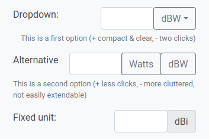
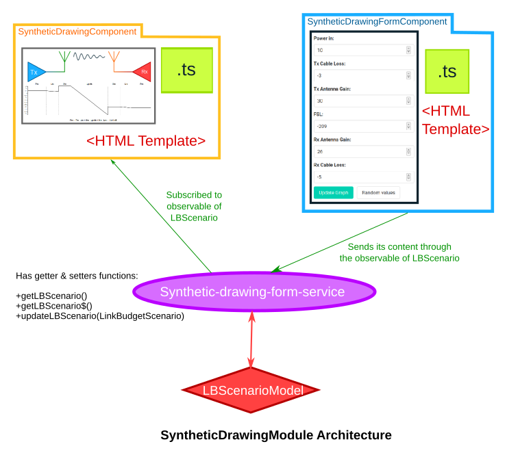

**Luplink: Link Budget calculation inside JSatOrb**

# Introduction

The goal of this project is to build an interface for link budget calculation and integrate it inside JSatOrb. It should provide at least the same capabilities as the AMSAT sheet while making use of the added functionnalities provided by web applications.

<p align="middle">
  

  
</p>

*Figure*: JSatorb on the left, and luplink integrated inside JSatorb on the right
<!--   -->

# Table of contents

- [Introduction](#introduction)
- [Table of contents](#table-of-contents)
- [Current tools](#current-tools)
- [Generalities](#generalities)
  - [**Link budgets**](#link-budgets)
    - [**Static vs dynamic**](#static-vs-dynamic)
    - [**What variables do we need?**](#what-variables-do-we-need)
  - [**Integrating Luplink to JSatorb**](#integrating-luplink-to-jsatorb)
    - [**UI: how to navigate between both applications**](#ui-how-to-navigate-between-both-applications)
    - [**Data**](#data)
    - [**API**](#api)
- [Tools](#tools)
- [What frontend framework to use ?](#what-frontend-framework-to-use-)
    - [Some examples of frameworks:](#some-examples-of-frameworks)
    - [Comparison](#comparison)
- [Styling](#styling)
- [What CSS framework ?](#what-css-framework-)
- [Linting & Prettify](#linting--prettify)
- [Testing](#testing)
- [Diagrams](#diagrams)
- [Others](#others)
- [Building the interface](#building-the-interface)
  - [Layout system](#layout-system)
  - [**V0**](#v0)
    - [**Card layout**](#card-layout)
    - [**Sidebar**](#sidebar)
    - [**Forms**](#forms)
    - [**What about units ?**](#what-about-units-)
    - [Form Validation](#form-validation)
    - [Diagram (block diagram + plotting a graph)](#diagram-block-diagram--plotting-a-graph)
    - [Default form](#default-form)
  - [**V0.1**](#v01)
    - [New hierarchy:](#new-hierarchy)
    - [Antenna selection](#antenna-selection)
    - [Displaying results](#displaying-results)
    - [Logging](#logging)
- [Backend](#backend)
- [Other explanations:](#other-explanations)
  - [Detecting changes](#detecting-changes)
- [Math formulas](#math-formulas)

# Current tools

- AMSAT spreadsheet
- SatOrb 
- JSatOrb

<p align="middle">
  

  

  
</p>
<!--   -->

# Generalities

## **Link budgets**

A link budget is useful when designing a communication system. It accounts for the many losses that can happen during communication and returns a margin in dB. This margin will determine how easily it will be to communicate with our satellite.
### **Static vs dynamic**

Often we use the worst-case scenario and calculate a link budget at a specific instant. While this help us know if the link will be possible or not, this omits some interesting questions : how much data will we be able to transfer during the pass? How well will our system handle pointing errors at high elevations?)

A dynamic link budget is similar to a static link budget. It has varying geometry (slant range & elevation) and its inputs depend of time. This is already handled by linkpredict.

<!-- In the case of a static link budget, we are only interested in fixed output values while for a dynamic link budget we want to see their evolution (and also calculate the amount of data transferred for instance) -->
it might be
### **What variables do we need?**
An attempt to classify required inputs gives us this diagram:

<p align="middle">

</p>

<!--  -->

This will be useful for designing the application layout.

## **Integrating Luplink to JSatorb**

There are multiple levels of integration : 
- data, importing data from JSatOrb into Luplink
- UI, easily navigate between both applications
- API, importing data from nanospace

### **UI: how to navigate between both applications**

There are 2 main solutions : 
- **Tight integration**: using luplink as a module inside JSatOrb. 
  - Only one application
  - Requires converting our components to a library
- **Loose integration**: Both applications keep existing separately and we access them with different URLs. This involves having two different web adresses
  - Easier
  - Less user friendly
  - Added complexity for deployment (but maybe doable with a particular Apache configuration / website structures (see https://geekflare.com/fr/multiple-domains-on-one-server-with-apache-nginx/). For instance: jso.localhost:80 & luplink.localhost:80

It seems the cleanest solution involves converting luplink to a library. This way, we can import its components both inside luplink-standalone & JSatOrb with the added perk of reformating the code in a cleaner way.

The chosen library architecture involves packing each feature (one or more components) inside a module and importing these modules to build the interface.

The development speed is not impaired thanks to the use of ```npm link``` which allows for quick rebuild of the library on changes (as fast as a basic appliation `ng serve`). This is explained in the README

We end of with a workspace with the following structure:
- `projects/`
  - `ngx-luplink/`: the library
  - `luplink-app/`: the standalone application

It is still possible to serve the standalone application. But it is also possible to publish the library, allowing to import its modules inside JSatOrb or any other application!

### **Data**
When exporting data from JSatOrb, we have particular informations such as:
- satellites
- constellations,
- ground stations

We can let the user choose between all of these and import SMA+elevation in Luplink before doing the calculations
Since we already had the possibility to import .jso files, this was not too much of a hassle to implement. JSatorb can export its configuration in this format and we can read it directly inside luplink. A service called jso-link.service.ts handles the data transmission between both applications.

### **API**

Some nanospace angular components are available, allowing to fetch data from database.
Problem is, fetching all data at once would be easier for the user but the way the database is constructed makes it a bit complex. We should look for a solution to do so.

We can use the ngx-nanospace-lib to have access to nanospace data.


**In the end, the library strategy seems to have payed off, we can now develop separately luplink from JSatOrb and still have a clean integration between the two. The main downsides are an increase in the complexity to start developping and to deploy. The README.md will need to explain the development process thoroughly.**


# Tools

In order to build this application, we will be using several tools. The following section describes the different tools chosen and the reasons that lead to these choices.

# What frontend framework to use ?

The frontend framework is a bundle of javascript code that handles most of the logic part of the application and its building blocks for us: a component system, routing, updating the view, handling user interaction. It adds a layer of abstraction between the browser and our application making it easier to write code.

### Some examples of frameworks:

- **Angular**, provides good abstraction, encourages good coding practices. Maintained by Google. Considered by somes a bit over-engineered. _See: Angular Coding Style (https://angular.io/guide/styleguide)_

- **Vue.js**, A lighter and easier alternative to Angular. It also has better performances. However testing has not been as closely tied to the framework as it is the case for angular. _See: Comparison between Vue.js and other frameworks by the Vue.js team (https://fr.vuejs.org/v2/guide/comparison.html)_

- **React**, Maintained by Facebook.
- **Others**, a lot of other framework exist and could fit our need. However the three previous ones have a lot of support & documentation.

*Comparison of Vue, React and Angular in terms of GH stars:*

<p align=center>
  
<p align=center>
<!--  -->

### Comparison

|               | Angular                                                       | React                                                                                                                               | Vue.js                                                                   |
| ------------- | ------------------------------------------------------------- | ----------------------------------------------------------------------------------------------------------------------------------- | ------------------------------------------------------------------------ |
| Maintained by | Google                                                        | Facebook                                                                                                                            |                                                                          |
| **pros**      | Lots of functionnalities out of the box                       |                                                                                                                                     | Extensive built-in capabilities                                          |
|               | Convenient to refactor old code                               |                                                                                                                                     | Really Light                                                             |
|               | Better reusability of components                              |                                                                                                                                     | Convenient to use                                                        |
| **cons**      | High threshold of entry                                       | Not a complete framework but instead a libray, more time consuming. 3rd party tools might become outdated, adds cost to development | Runtime errors frequent and frustrating (linked to convenience of usage) |
|               | Lot of conceptual overhead / Considered a bit over-engineered |                                                                                                                                     |                                                                          |

_Opiniated sources_ :
https://sloboda-studio.com/blog/the-ultimate-comparison-angular-vs-react-vs-vue/
https://itnext.io/dont-be-afraid-and-just-ng-update-1ad096147640

According to these articles, Angular updates happen regularly, at fixed times and are not breaking software too often too much. While Google is known for closing projects, Angular has a big user base and is MIT-licensed. It also has some maturity (AngularJS started in 2009 and Angular2 in 2016 so at least 5 years).

**In the end**: There is no real outcomer. All these frameworks have been used to build successful web applications, are documented and have important user bases. The choice might end up being based on personal preferences.

**Angular still has good testing capabilities out-of-the-box and uses typescript which enforces good programming practices. JSatorb is using Angular. So using this framework sounds like a sensible choice.**

_We are using version 11 which was realeased in November 2020 (5 months before this internship) and will be kept in LTS until May 2022. This implies upgrading JSatorb from Angular 8 to Angular 11_

# Styling

Browser use css to style the content (html) of our webpages. Angular natively handles SCSS which is a CSS pre-processor. SCSS add many useful capabilities to CSS (variables, basic calculations) which are converted to CSS when building the application

Documentation of SASS showcasing some capabilities: https://sass-lang.com/guide. 

It is under a MIT License. SCSS provides inheritance, variables & operators and is based on the DRY philosophy _(Don't Repeat Yourself)_. This is a good choice for our project. It doesn't require too much knowledge. 

_Ressources : https://learnxinyminutes.com/docs/sass/_

**SCSS advantages** : Increases readibility and intuitive to understand

# What CSS framework ?

A CSS framework provides us with building blocks (navigation bars, cards, forms, columns, ...) allowing to quickly prototype a clean and consistent user interface. The alternative would be to write all the CSS code by ourselves which requires a lot of time.

Lots of CSS frameworks exist. They often provide similar capabilities.

- **Bootstrap**, One of the biggest CSS frameworks. It is well documented and has extensive capabilities. It can however look a bit bland since it is used a lot. It is also a bit heavy as it requires jQuery (unless we use one of the two angular modules below but the installation procedure is complex)

Alternative CSS frameworks :

- **Bulma**, is a pure CSS framework, gaining some momentum. It is simple to use and has powerful tiling capabilities. It is also much lighter than bootstrap.
- **Picnic**, simple & opiniated CSS framework, open-source
- **Angular Material**, close integration to Angular, for a Material look
- **Semantic UI**, good alternative to Bootstrap

**ngx-bootstrap / ng-bootstrap** : Two different teams working on similar goals : Making Bootstrap usable without jQuery in Angular (however couldn't get ngx to work and ng does not support Angular 11)

**Material Design** This has been carefully designed. However, I feel like this isn't totally adapted to "data-heavy" UI, it takes up a lot of space. An other issue is the generic Google look of the application, unless we don't follow all the rules. Material Design Lite is another alternative

**From the nanospace-client-lib README, bootstrap might be required for displaying *nano-nanospace-input* components**

We ended up using Bulma which worked quite well since it did not require any scripts. However the mix between material used in JSatorb and Bulma inside Luplink is not elegant.

# Linting & Prettify

- Linting has a set of opiniated rules on how we should write code. Using a linter and its add-on inside the code editor makes our code more consistent and a bit cleaner without too much troubles. It also warns us of common confusions while writing TypeScript.

Angular 11 is at a cornerstone, TSLint while deprecated is still installed by default. We migrated from TSLint to **ESLint** so that it won't cause issues in the future.

This was the opportunity to set-up linting. We added the standard "AirBnB-base" linting rules since the code is intended to be shared. These rules are known to be quite restrictive, some of them were later disabled. We also disabled the prettifying rules from the linter since we used an external prettyfier.

- We also used a **Prettier** that provides opiniated rules on how the code should look. This one helps us write consistent code and automatically fixes spaces and missing semi-colons.

# Testing

Unit testing in angular requires a lot of boilerplate code to write. Handling dependencies between components can quickly become cumbersome. 

One of the proposed solutions is to use the NO_ERRORS_SCHEMA. However by doing this, template errors are ignored. This is not ideal.

This leaves us with three correct solutions on how to do unit testing : 
- Writing mocks for 1st level dependencies (calling them component_name.component.mock.ts, and making it implement the real component) 
- Can avoid mocking if doing integration tests 
- Using external tools like the npm module **Spectator** that drastically reduces boilerplate code and provides solutions for quickly mocking components, services, ...

This last solution seemed to be a good compromise yet after some time without using it, learning to use spectator again is not ideal. The documentation is sometimes a bit outdated. Sticking to classic unit-tests seems better in the long run.

Found [an interesting Medium article](https://medium.com/@abdul_74410/towards-better-testing-in-angular-part-1-mocking-child-components-b51e1fd571da) (saved in parent folder) explaining how to handle dependencies between components while testing (from least preferable to most preferable):
- Adding child component to declarations (least preferable)
- Adding NO_ERRORS_SCHEMA: misses some errors
- Manually mockup components: lot of boilerplate code
- use of ngMock, MockComponent() (most preferable)

**In the end, we use the default Jasmine TestBed for all our tests. This makes our test a bit more verbose but easier to fix if something goes wrong. Also, the default test file is quite bulky but a test file for a basic component can be much simpler.**
  
**What to test ?**

- _generic-form_
  - should create each field
  - should display the correct labels
  - should not be valid if wrong type of input / too long / short ?
  - should provide all units
  - should have the correct default unit
  - should have the correct default values
- _dashboard_
  - should display the cards
  - cards should have the correct title
  - cards should have the correct color
- _sidebar_
  - should display the data at the right place
  - should provide a button
- _services_
  - how to test services ? Most of the logic there
- Other components don't implement much logic yet, writing correct tests for generic-form will be a good start

And then continue with integration testing : https://dev.to/cjcoops/how-to-write-simple-angular-integration-tests-with-spectator-1i1b

Testing a component by mocking services (3 ways):
https://blog.danieleghidoli.it/2016/11/06/testing-angular-component-mock-services/

**API Testing**

In the end, the API has not been tested separately:
- python-linkpredict has its own tests
- the integration tests check that we can run calculation with the API.

**Performance Tests**

A first way to do performance tests is by using Apache Bench `ab -n <number_of_requests> -c <concurrency> <url>`

# Diagrams

AMSAT uses block diagrams which makes it clearer.

In order to have similar diagrams, the use of SVGs is suitable : robust, easy to create & edit programmatically.

Adding annotations is a bit more problematic : text positionning in SVG can be tricky. A first solution is to use absolute positionning and DIV elements.

Then we want to make them scalable which is confusing at first but seems doable using JavaScript, foreign HTML elements inside the SVG (https://stackoverflow.com/questions/6725288/svg-text-inside-rect) or something else

It might seem that the chosen solution doesn't work as well as expected, a bit fragile. 

*Alternative*: The HTML canvas tag exists but is not dedicated to this kind of use. It is made for rapidly changing content and is resolution dependant (difficult to resize).

# Others

- **Popper.js**, handles tool-tips positioning and overflowing for us, open source (included in bootstrap.**bundle**.min.js), used by BS for dropdowns menus

- ngx-nanospace-client-lib depends on **'@fortawesome/free-solid-svg-icons'** et **'@fortawesome/angular-fontawesome'** these icons are open-source, we can use them for our project.

> **/!\ REALLY IMPORTANT /!\ : Don't ever forget to import FormsModule along with nanospace-client-lib to avoid unrelated error messages. Refer to ngx-nanospace-client-lib README and strictly follow it!**

# Building the interface

## Layout system

To be able to quickly switch between totally different interface ideas, having a layout system is interesting. This means keeping as many components as possible while filling the link budget.

This is done using the RouterModule and nested routes : we can call a container module and children components through the path

However it can be quite hard to reuse some of the components between the two layouts. For instance, in the case of a simple form component, while the logic stays exactly the same, the template uses entirely different classes and structure depending on the CSS framework.

## **V0**

<p align=center>
  
<p align=center>
<!--  -->

This first layout uses Bootstrap. Most of the work has been done on the underlying form logic, allowing communication with API, reusability of components and making it easy to add new parameters for calculations. This was also used to experiment with SVG drawings and bootstrap layout system.

Features: Form generated from a .json file, Units system

<p align=center>
  
<p align=center>

<!--  -->

In the next part, we discuss functionnalities of this version and the reasons for having them
### **Card layout**

A card layout is well suited to the component paradigm of angular. This allows us to separate information effectively and make the form more bearable for the user. 

- **Cons** : *We lose some hierarchy of information, too much cards is equally overwhelming.*

Some issues with positioning on ultra-wide monitors. But easy to add support for small screens

### **Sidebar**

There was the idea of using a sidebar to show calculation at all times. At first, tried to add a column but too complex, not possible to use as a component. Tried implementing it with classic HTML, some result but not ideal. Also this sidebar isn't responsive.

ng-sidebar exists but not actively maintained.

angular-material has sidenav which seems to fit the use case.


### **Forms**

Forms are at the heart of this application. The user has to input a lot of data. We want to avoid making this too tiresome, complex or inefficient.

**Form Architecture:**


We generate our form directly from a JavaScript object (equivalent to .json file). Each form component handles its own values and reports them back to a service called FormService whose role is to keep track of the global state of the link budget.


**Units:** 

Two ways to represent units, with each its advangages. Having both at the same time lacks consistency. I slightly prefer the dropdown as it is more compact, easily extendable, and unambiguous.



_Should an input field be a component ?_ (https://dev.to/tsuzukayama/angular-5---how-many-components-is-too-many-components--2l9c).

These inputs require setting a unit and some logic so it might be a good idea to make it into a component.

**Reusability:**
The forms are generated from json objects. This adds reusability and result in probably cleaner components for a reasonable added complexity.

**Implementation:**
In angular there are two techniques to create forms : template-driven and reactive.

| Template-Driven               | Reactive                           |
| ----------------------------- | ---------------------------------- |
|                               |                                    |
| Asynchronous                  | Mostly Synchronous                 |
| Logic driving by template     | Logic in component                 |
| Legacy                        | Modern                             |
| Limited to e2e tests          | Form validation can be unit tested |
| adapted to small/medium forms | A bit overkill for small forms     |

_(reference: https://blog.angular-university.io/introduction-to-angular-2-forms-template-driven-vs-model-driven/)_

From this comparison, it appears clear that Reactive forms are better suited in our case (complex form splitted in multiple parts)

<!-- #TODO: Simplify next section, lot of history but might not be needed!

The data is split into many sub-forms. I started to implement it before stumbling upon this example which corresponds to our goal: https://itnext.io/partial-reactive-form-with-angular-components-443ca06d8419
https://coryrylan.com/blog/building-reusable-forms-in-angular
https://medium.com/angular-in-depth/angular-nested-reactive-forms-using-cvas-b394ba2e5d0d (composite Control Value Accessors)

This will require a bit more thought than initially expected. The main solutions for this would be:

- Parent to child communication with @Input and @Ouputs
- Communication using RxJs and services
- Making sure every form has a same common parent

The child-parent solutions would have some impact on the layout. It would also become really confusing real quick with these chains of @Inputs/@Outputs.

Using services seems like the obvious solution after some comparison. However using RxJs is not simple.

Merging Observables : https://github.com/ReactiveX/rxjs/issues/1308

https://angular.io/guide/dynamic-form

-> ArrayForms handles multiple FormGroup thus allowing to get notified from each change in forms. -->

One of the difficulty was to prevent route changes to cause data loss. The solution chosen was to make the components as persistent as possible and to keep a global state of the form as a reference.
<!-- Ideas :

- Recover the state on tab change
- Don't use routing (make a full-page form and hide sections as required)
- RouteReuseStrategy -> This works but this doesn't feel totally right. #FIXME: Go back here, clean up and find if it's still a good idea

https://github.com/angular/angular/issues/5275 -> see RouteReuseStrategy / Sticky routes
https://samerabdelkafi.wordpress.com/2020/12/14/angular-rout-with-sticky-state/
https://medium.com/@disane1987/angular-router-and-tab-based-navigation-within-a-spa-c0a8ca2b3bc4
This can be handled more easily by UI-Router library

_Questions_: -Where to handle units ? (For now in BE but would also make sense to handle them in FE)
**Finally have something working for the form, maybe a bit convoluted, should compare with other frameworks** -->

<!-- _How to handle data not entered ?_

We cannot guess, in the future persistance of data, possibility to import. Right now maybe some generic data automatically inputed to save time when using the interface.

- import inputs from a file (will be useful later)
- construct the JSON request from this -->

<!-- **In the end, all data will be known, whether the components are created or not** -->
**Default values**: We want to make this easy to use for the user. Having default values allow him to run the calculation without having to ender dozens of fields.

**Save/Load capabilities:** The user can upload or download the json state of the form.

### **What about units ?**

Getting both values and units could have been done with a custom FormControl.

Really interesting article about how to build custom ControlValueAccessor on [indepth.dev](https://indepth.dev/posts/1055/never-again-be-confused-when-implementing-controlvalueaccessor-in-angular-forms)

Article explaining [how to build a custom component](https://blog.thoughtram.io/angular/2016/07/27/custom-form-controls-in-angular-2.html) (the conclusion is to use native components as much as possible) 

In the end, it was deemed easier to simply use a FormGroup containing two FormControl. And it worked just fine.

### Form Validation

We need to run some checks on the form before sending it to the API.

Objectives :

- Clear explanation of how to fix the error
- Avoid user frustration (eg: validating fields too late or too soon, not helping much if something is wrong)

Rules :

- Fields:
  - Empty field -> default value used (for educational purposes) -> let the user decide if he wants some strict mode ?
  - Non-numerical value -> error (later we'll also have dropdowns to validate, but no text ?)
  - Number of digits limitation ? -> 1MW ?
- Units:
  - One is selected by default for convenience
  - Expect user to validate it himself
  - Support for custom units ? -> implies parsing them, having too many of them in the dropdowns would be frustrating. Maybe giving the possibility to use pre-defined custom units to users in a settings menu ?

Realisation :

- if default values are used, give some gentle 'important' _orange_ notification (in the tab, near the fields and near the synthesis)
- if incorrect values are given, show a pop-up warning and clearly indicate the faulty tab and fields with a _red_ marker
- When a tab is correct, some subtle confirmation everything is fine -> giving a sense of completion, progress (but avoid making everything cluttered because of this)

Also :

- Add custom validation rules : frequency should be >0 while gain can be negative
- Clearly define whether the losses are positive or negative (losses -> , gain ->)
- Defining a form as a table just like below would be a good idea


  

### Diagram (block diagram + plotting a graph)

We want to provide some visual feedback to our user. Building a simple graph similar to the ones found in documentation was a first step. Hereis an example of what we want to accomplish:

<p align="middle">
  
</p>

We used D3.js in order to handle plotting the graph.

At first we tried to do the block diagram part with D3.js but it clearly was inefficient. Since this part of the diagram didn't depend on any data, it was easier and faster to draw it using Inkscape.

There are other alternatives to D3.js : using HTML5 Canvas, since we won't be redrawing it too often could be interesting. Other SVG libraries such as svg.js


*Here is the architecture of how it was first handled:*

<p align="middle">
  
</p>

The subscriber and observers arrow are a bit messy. The next step was to use an Observer design pattern. In Angular, this is frequently used as RxJS already implements it through [Observables](https://angular.io/guide/observables).

The RxJS BehaviorSubject allows multiple observer to observe the same observable instance. By making the LBScenario as such we can subscribe to it as many time as we want

*Improved architecture :*

<p align="middle">
  
</p>

This takes advantages of RxJS capabilities and makes a much cleaner & robust structure.
### Default form

We want to provide a default example to user. One way to do it would be using placeholders values and filling the gaps. The issue is that the user might forget to fill one of the fields and end up with the wrong result. To fix this, we could add a visual indicator that some default values are used but this might be visually too distracting or too easy to miss.
A solution is to NOT use placeholders, fill the values with a 'default' config and let the user change this config or even create his own.

Timeline:
- User opens app, default scenario pre-filled
  - User changes the scenario, the form updates
  - User changes a value, the scenario switches to 'custom'
  - User chooses to create a new scenario
  - Possibility of saving / loading


## **V0.1**

Added a layout system and started working on a second layout using Bulma CSS framework instead of Bootstrap


The idea was to : 
- Find shortcomings of v0 and fix them
- Check reusability of components
- Test new design and UX ideas, experiment with other frameworks to find one that fits our needs.

This layout frees some vertical space, keeps the cards and add a sidebar navigation.

Reusing some of the components required small changes but nothing too time-consuming.

About Bulma :
  - Documentation sometimes a bit sparse or incorrect but not too much of a hassle.
  - Much easier to add units to our form with "add-ons" compared to Bootstrap
  - The form template can be a bit heavy with a lot of "controls" divs.

### New hierarchy:

The left sidebar was confusing. Different concepts at the same level. Wanted to improve it & find a cleaner base layout for the future.

*Some observations:* 
- Should keep editing values consistent, always at the same place
- Clear and concise navigation, user should know  exactly where to click to edit a certain parameter
- There's a compromise between compacity & easy to locate information : either we have a lot of unused space with lots of clicks to get to a precise value or we have many parts together minimizing the amount of effort to get there but this is less readable.

**static, dynamic, basic or full?:** in order to choose efficiently between these, we can tie them to the current LB being edited as a parameter. When we switch from full -> basic, we keep all informations but don't use it for calculations.

**hierarchy:** Based on the Input Hierarchy diagram, we'll have main categories for differents LinkParts and subcategories for sub-LinkParts. We will have a 2-panel interface with an edition zone & a synthesis zone. In the synthesis zone, we will be able to switch between local & global and in the editing zone, we will find our sub-forms organized by sub-LinkPart allowing user to get to them directly either by using HTML anchors or scrolling.

**pros:** Solves many of our previous issues and it is easy enough to make it responsive. A good compromise between too much white space and clearly organized inputs.

**cons:** Not many for now, maybe too much scrolling.


### Antenna selection

Had to redefine the way we handle user inputs in order to incorporate antenna-selection, ...

In the end a bit too complex to handle and was removed from final version

### Displaying results

### Logging

Already had a basic logger service in v0. This logger allows to keep all logs at the same place. For instance, by using the Toastr angular module, we can get errors to be directly visible by the user (& developper)


This made me think about giving a visual cue when frontend is connected to API. 

#TODO: One way to do it would be to ping regularly the back-end. This would require persistent HTTP connection in order to minimize handshakes. Is it worth it ? Might be simpler to just give loading, ...

<!-- ## Components inventory

- Layout 1:
  - card
  - navbar
  - sidebar
  - tabs
  - views : *These are typically not reused because they are tightly coupled to the CSS framework and how components are to be positionned*
    - dashboard
    - diagram
    - downlink
    - uplink
- Layout 2
  - card
  - simple-lb
  - synthesis
  - uplink
- Shared
    - generic-form: *A simple generic form that can be passed to a card through ng-content*. **These are linked by the form service and should be provided with a Form object as @Input**
    - synthetic-drawing: *A D3.js graph + SVG drawing representing a radio link*
    - synthetic-drawing-form: *Can be used along with synthetic-drawing to directly input data and update graph* -->

<!-- ## Naming

- **Component** : using this term for the different parts of the comm is confusing with the angular concept of component. Alternatives : part, subsystem, **LinkPart** #TODO: find alternative -->

# Backend

Available libraries:

- Django : slightly overkill since it has a lot of similarities with angular
- Bottle : Good option according to [1] (lightweight but comprehensive)
- EVE : for small to medium-sized projects
- Flask-RESTful
- Restless : light framework that allows using the same API code for any WSGI framework
- ...
- 
[0] https://www.fullstackpython.com/api-creation.html (Ressources on how to build an API in Python)
[1] https://nordicapis.com/8-open-source-frameworks-for-building-apis-in-python/ (Comparison of OSS projects for building APIs in python)

Notes : 
- See which API testing tools exist
- Clear documentation is paramount to API creation.
- RAML : REST API Modelling Language https://raml.org/about-raml
- Swagger (OAM)

# Other explanations:

## Detecting changes

The ngOnChanges() function in angular is considered to have some problems : is called for each input change so it requires filtering which property actually need to be changed. This reduces readability.

Using getters and setters is a first alternative, but it introduces a new ghost variable which can be changed anywhere in the code. It is also quite verbose.
The typescript way of doing it would be with decorators. However it is still considered an experimental feature so we will stick with getters & setters. [See reference](https://angular.io/guide/component-interaction#intercept-input-property-changes-with-a-setter).

NgOnChanges() might still be used for multiple interacting input properties.

When and how to use each of the first two approaches: [see on StackOverflow](https://stackoverflow.com/questions/38571812/how-to-detect-when-an-input-value-changes-in-angular)

<!-- # Card system

*Comprehensive architecture diagram*

#TODO: Explanations on how to add new cards, ... -->
<!-- 
# Documentation

Users should have access to documentation about what the different values are, ... -->

# Math formulas

We will probably need to display easily some math formula. 

*From MathJax documentation:*
>"MathJax is an open source JavaScript display engine for mathematics that works in all modern browsers"

It is used by mathoverflow and other math blogs. It seems to be a reliable, widely used solution.

However this solution is poorly handled by Angular, because of issues with the use of { } in the templates.

So currently, we can display MathJax Formula contained in variables containing HTML but we cannot use them directly in the template because Angular won't allow it. The issue of keeping the HTML in variable is that we do not have access to tools to properly format it.

A solution could be to put this documentation in external HTML files and load it.

In the end, the installation of MathJax on angular was too much of a hassle and we ended up choosing an angular module called **ng-katex**. It is able to display LaTeX code contained inside a variable.

